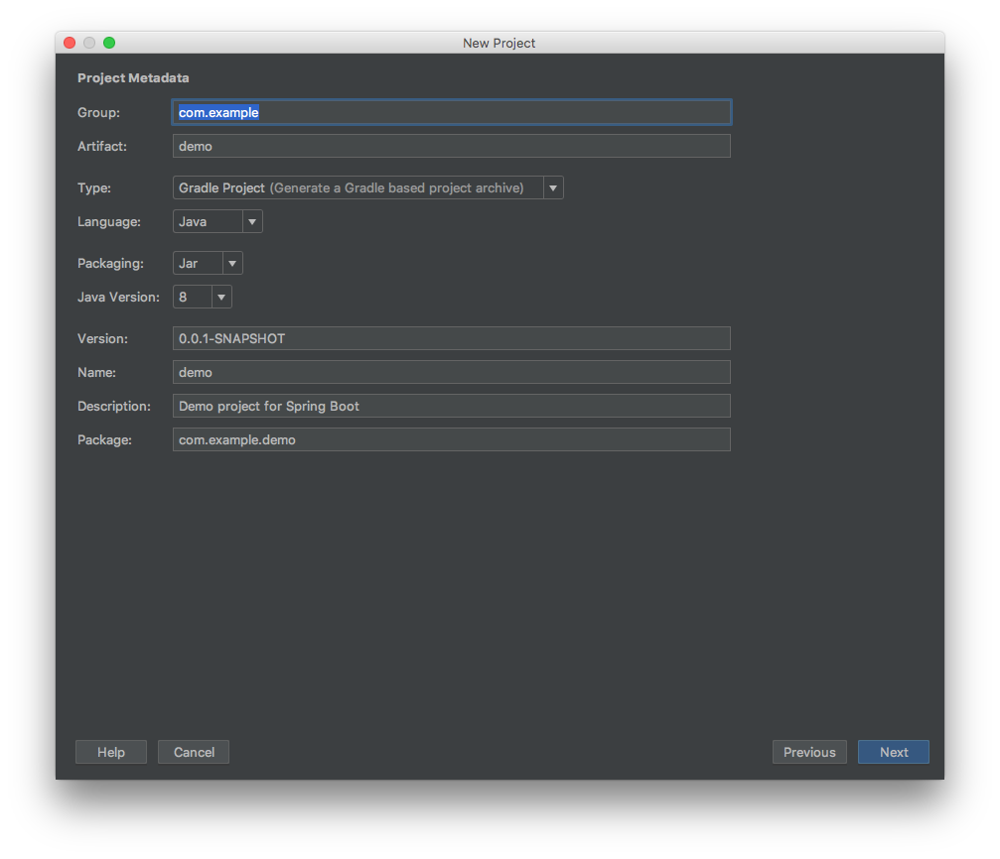
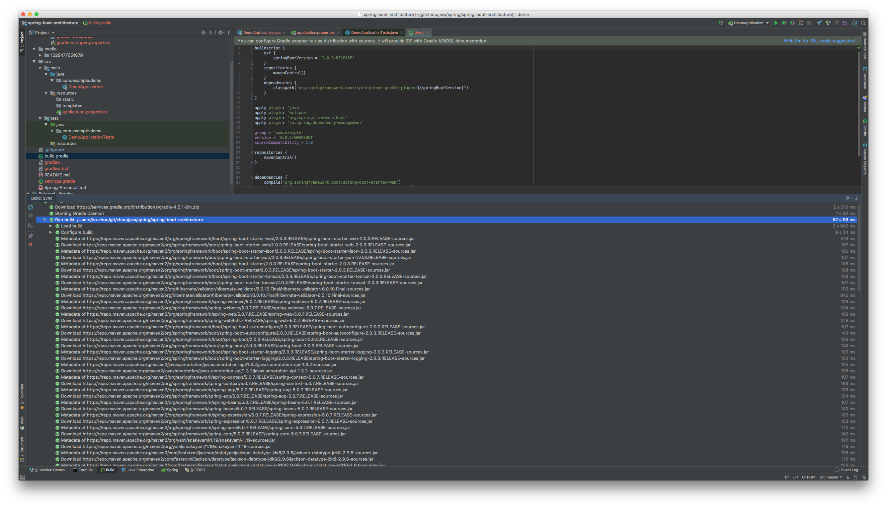

# README

---

> spring-web-starter by gradle

### settings







* 直接运行报错, classpath找不到

    ```bash
    $ ./gradlew build
    ```

* 显示配置


* 显示model的依存关系


### Files

```bash
$ tree
.
├── build.gradle # 主要的配置文件
├── gradle  # 自动生成的文件
│   └── wrapper
│       ├── gradle-wrapper.jar
│       └── gradle-wrapper.properties
├── gradlew
├── gradlew.bat # 自动生成的文件
├── out # build成果物
│   └── production
│       ├── classes
│       │   └── com
│       │       └── example
│       │           └── demo
│       │               └── DemoApplication.class
│       └── resources
│           └── application.properties
├── settings.gradle # 一些环境变量
└── src # src以下的目录结构
    ├── main
    │   ├── java
    │   │   └── com
    │   │       └── example
    │   │           └── demo
    │   │               └── DemoApplication.java # 主程序
    │   └── resources # 主程序配置
    │       ├── application.properties # 程序的配置信息
    │       ├── static
    │       └── templates
    └── test # 测试
        ├── java
        │   └── com
        │       └── example
        │           └── demo
        │               └── DemoApplicationTests.java
        └── resources
```


