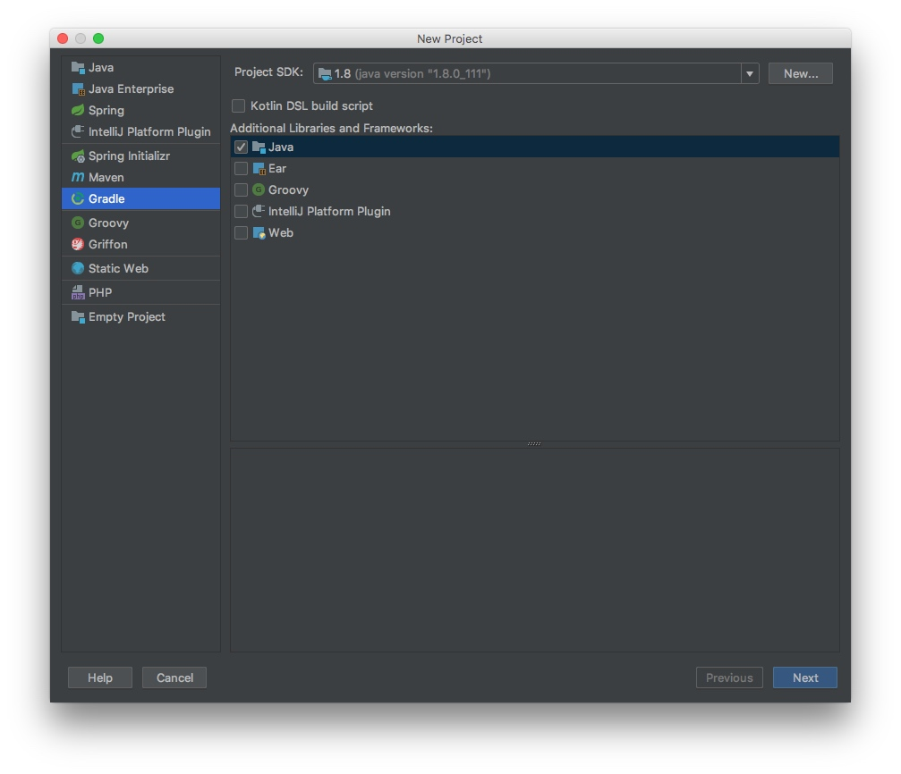
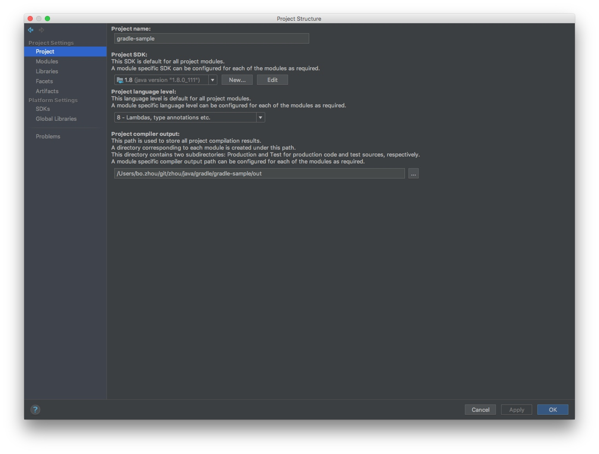
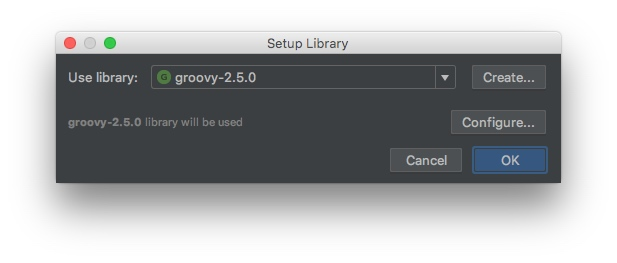

# Spring-Preinstall

---

### 安装
1. mac install

    ```bash
    $ brew install maven
    $ brew install gradle
    $ brew install groovy
    $ brew install springboot
    
    # JAVA_HOME
    $ echo "export JAVA_HOME=`/usr/libexec/java_home -v 1.8`" >> ~/.zshrc
    $ source ~/.zshrc
    $ mvn -v
    
    Apache Maven 3.5.3 (3383c37e1f9e9b3bc3df5050c29c8aff9f295297; 2018-02-25T04:49:05+09:00)
    Maven home: /usr/local/Cellar/maven/3.5.3/libexec
    Java version: 1.8.0_111, vendor: Oracle Corporation
    Java home: /Library/Java/JavaVirtualMachines/jdk1.8.0_111.jdk/Contents/Home/jre
    Default locale: ja_JP, platform encoding: UTF-8
    OS name: "mac os x", version: "10.13.3", arch: "x86_64", family: "mac"
    
    $ gradle -v
    
    ------------------------------------------------------------
    Gradle 4.8
    ------------------------------------------------------------
    
    Build time:   2018-06-04 10:39:58 UTC
    Revision:     9e1261240e412cbf61a5e3a5ab734f232b2f887d
    
    Groovy:       2.4.12
    Ant:          Apache Ant(TM) version 1.9.11 compiled on March 23 2018
    JVM:          1.8.0_111 (Oracle Corporation 25.111-b14)
    OS:           Mac OS X 10.13.3 x86_64
    
    $ java -version
    java version "1.8.0_111"
    Java(TM) SE Runtime Environment (build 1.8.0_111-b14)
    Java HotSpot(TM) 64-Bit Server VM (build 25.111-b14, mixed mode)
    
    # gradle的配置
    $ echo 'org.gradle.daemon=true
    org.gradle.parallel=true
    org.gradle.configureondemand=true' > ~/.gradle/gradle.properties
    ```

2. intellij
    
    

    
    
    

3. [groovy sdk指定](https://www.jetbrains.com/help/idea/configuring-testing-libraries.html)
    

    ```bash
    # brew install groovy
    location: /usr/local/opt/groovy/libexec
    ```


